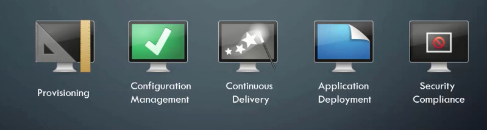
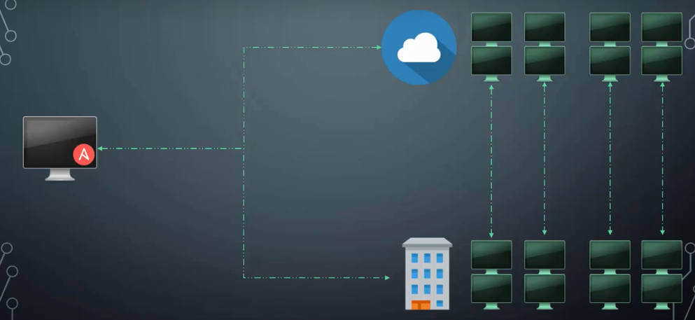

# Ansible - Hands-On

## Content

- [Ansible - Hands-On](#ansible---hands-on)
    - [Content](#content)
    - [Introduction to Ansible](#introduction-to-ansible)
    - [Ansible Basic](#ansible-basic)
        - [Introduction to YAML](#introduction-to-yaml)
        - [Ansible Basic Inventory](#ansible-basic-inventory)
        - [Ansible Basic Playbooks](#ansible-basic-playbooks)
        - [Ansible Basic Modules](#ansible-basic-modules)
        - [Ansible Basic Variables](#ansible-basic-variables)
        - [Ansible Basic Conditionals](#ansible-basic-conditionals)
        - [Ansible Basic Loops](#ansible-basic-loops)
        - [Ansible Basic Roles](#ansible-basic-roles)
        - [Ansible Basic Advanced Topics](#ansible-basic-advanced-topics)
    - [Ansible Advanced Advance](#ansible-advanced-advance)
        - [Ansible Advanced Advance Web Application](#ansible-advanced-advance-web-application)
        - [Ansible Advanced File Separation](#ansible-advanced-file-separation)
        - [Ansible Advanced Roles](#ansible-advanced-roles)
        - [Ansible Advanced Vault](#ansible-advanced-vault)
    - [References](#references)

- **[Ansible Advance](#ansible-advance)**
    - [Ansible Advanced Web Application](#ansible-advance-web-application)
    - [Ansible Advanced File Separation](#ansible-advance-file-separation)
    - [Ansible Advanced Roles]
    - [Ansible Advanced Asynchronous Actions] 
    - [Ansible Advanced Strategy]
    - [Ansible Advanced Error Handling]
    - [Ansible Advanced Jinja2] 
    - [Ansible Advanced Lookups]
    - [Ansible Advanced Vault](#ansible-advance-vault)
    - [Ansible Advanced Dynamic Inventory]
    - [Ansible Advanced Custom Modules]
    - [Ansible Advanced Plugins]
  
- [References](#references)

## Introduction to Ansible

- Why Ansible?

It helps to perform repetitive task, deploying application, applying configuration, securty audits, migrations, on multiple servers.

Ansible is a powerful IT automation tool, it is easy to lern and it is simple to use.

[Ansible Documentation](https://docs.ansible.com/)

[Video: Introduction](https://www.udemy.com/learn-ansible/learn/v4/t/lecture/7040832?start=0)

## Ansible Basic

### Introduction to YAML

See [Introduction to YAML](YAML.md)

### Ansible Basic Inventory

See [Ansible basics - Inventory](ansible_basic_04_inventory.md)

### Ansible Basic Playbooks

See [Ansible basics - Playbooks](ansible_basic_05_playbooks.md)

### Ansible Basic Modules

See [Ansible basics - Modules](ansible_basic_06_modules.md)

### Ansible Basic Variables

See [Ansible basics - Variables](ansible_basic_07_variables.md)

### Ansible Basic Conditionals

See [Ansible basics - Conditionals](ansible_basic_08_conditionals.md)

### Ansible Basic Loops

See [Ansible basics - Loops](ansible_basic_09_loops.md)

### Ansible Basic Roles

See [Ansible basics - Roles](ansible_basic_10_roles.md)

### Ansible Basic Advanced Topics

See [Ansible basics - Advanced Topics](ansible_basic_11_advanced_topics.md)

## Ansible Advanced Advance

### Ansible Advanced Advance Web Application

See [Ansible adbvance - Web application](ansible_advance_02_web_application.md)

### Ansible Advanced File Separation

See [Ansible adbvance - File Separation](ansible_advance_03_file_separation.md)

### Ansible Advanced Roles

See [Ansible adbvance - Roles](ansible_advance_04_roles.md)

### Ansible Advanced Vault

See [Ansible adbvance - Vault](ansible_advance_10_vault.md)

## References

[Udemy Course - Ansible for Absolute Beginner - Hands-On - DevOps](https://www.udemy.com/learn-ansible/learn/v4/content)  
[Ansible website](https://www.ansible.com/)
[Ansible Galaxy](https://galaxy.ansible.com/home)  
[OSBoxes](https://www.osboxes.org/)
