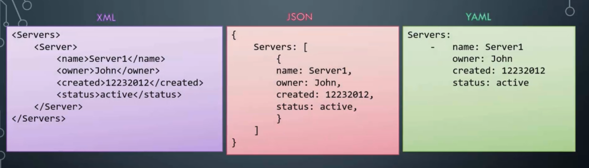
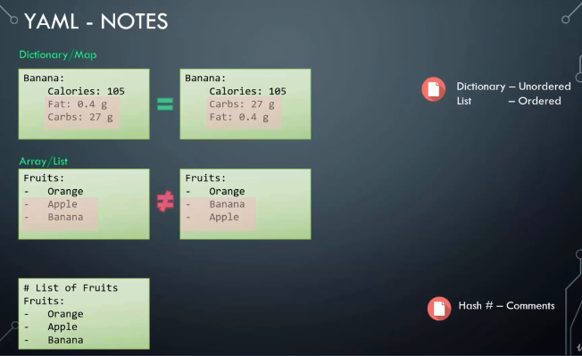

# YAML

## what is YAML?

Ansible Playbooks are files that are written in YAML. It is similar to XML or JSON as it is used to structure Data.

A YAML file is used to represent Data.



### YAML Examples:

- Key Value Pair:

```YAML
Fruit: Apple
Vegetable: Carrot
Liquid: Water
Meat: Chicken
```

- Arrays/ Lists:

```YAML
Fruits:
-   Orange
-   Apple
-   Banana

Vegetables:
-   Carrot
-   Cauliflower
-   Tomato
```

- Dictionary/ Map

```YAML
Banana:
    Calories: 105
    Fat: 0.4 g
    Carbs: 27 g

Grapes:
    Calories: 62
    Fat: 00.3 g
    Carbs: 16 g
```

> **NOTE:** Indentation and spaces are important in YAML. You must add a space after the **:**. Besides you must keep the indentation in Dictionaries and Arrays (The amount of spaces must be the same).

### YAML Advance Examples:

- Key Value/ Dictionary/ Lists (List of Dictionaries)

```YAML
Fruits:
    -   Banana:
            Calories: 105
            Fat: 0.4 g
            Carbs: 27 g

    -   Grape:
            Calories: 62
            Fat: 0.3 g
            Carbs: 16 g
```

### YAML NOTES

Dictionary is an unordered collection and list is a ordered collection. Besides, any line begining with a Hash #, is considered a comment.



Excersises: Update the YAML file to include Jacob's pay slips. Add a new property "Payslips" and create a list of pay slip details. Each payslip detail contains Month and Wage.

```YAML
Employee:
  Name: Jacob
  Sex: Male
  Age: 30
  Title: Systems Engineer
  Projects:
    - Automation
    - Support
  Payslips:
    - Month: June
      Wage: 4000
    - Month: July
      Wage: 4500
    - Month: August
      Wage: 4000
```

[Video: Introiduction to YAML](https://www.udemy.com/learn-ansible/learn/v4/t/lecture/7133354?start=0)
