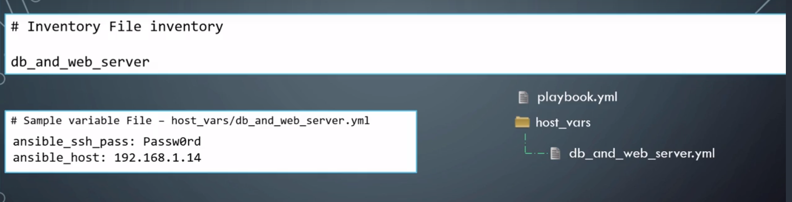
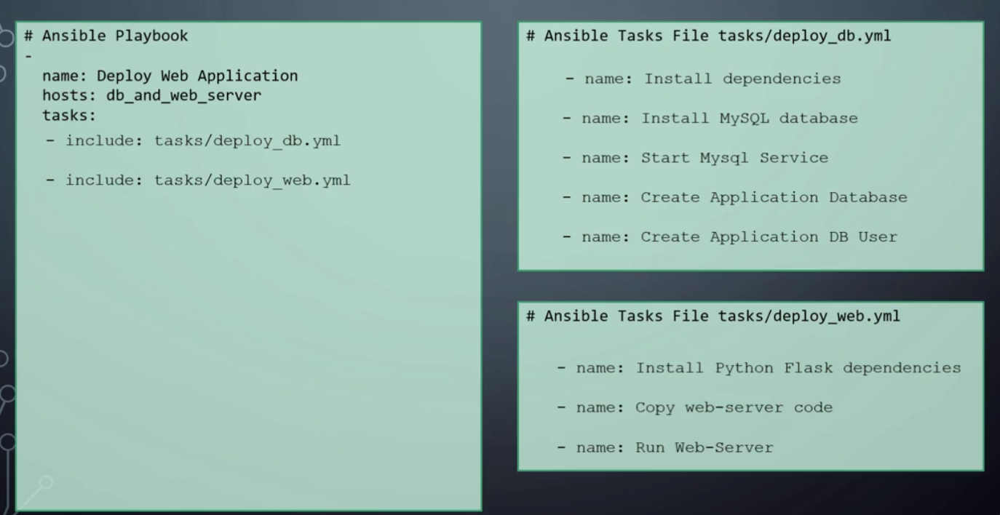

# Ansible Advance - File Separation

[BACK TO README](README.md)

## Ansible Advanced File Separation

### VARIABLE FILE SEPARATION

Up to now we  have been defining variables in the same inventory file. However this is not a best practice. It is better to define this in a separate file for that server.  

To do this first create a host_vars directory next to the playbook and then create a yaml file with the same name of the server. 

  

When ansible playbook is executed, ansible automatically reads the values from those files and associates them with hosts.

>**NOTE:** It is important to name the file with the same name as the host, it is also important to name the folder as *host_vars*  

It is also possible to have variables that applies to a group. In order to perform that you must create a folder called **group_vars** within this folder you could have a file for each group.


###  TASKS FILE SEPARATION and INCLUDE

To split the tasks, we create a folder called tasks and within that folder we create a file for each group of tasks.  

Within the playbook file in the tasks section we include the tasks files.

  


## DEMO

* **inventory.txt**

```txt
#Inventory
[db_and_web_servers]
db_and_web_server1 ansible_connection=ssh ansible_ssh_pass=Passw0rd ansible_host=192.168.1.14
db_and_web_server2 ansible_connection=ssh ansible_ssh_pass=Passw0rd ansible_host=192.168.1.15
```

* **app.py**

```python
# -------------------------------------------------
#
# This is the web application code. DO NOT MODIFY
#
# -------------------------------------------------

from flask import Flask
from flask.ext.mysql import MySQL
app = Flask(__name__)

mysql = MySQL()

# MySQL configurations
app.config['MYSQL_DATABASE_USER'] = 'db_user'
app.config['MYSQL_DATABASE_PASSWORD'] = 'Passw0rd'
app.config['MYSQL_DATABASE_DB'] = 'employee_db'
app.config['MYSQL_DATABASE_HOST'] = 'localhost'
mysql.init_app(app)

conn = mysql.connect()

cursor = conn.cursor()

@app.route("/")
def main():
    return "Welcome!"

@app.route('/how are you')
def hello():
    return 'I am good, how about you?'

@app.route('/read from database')
def read():
    cursor.execute("SELECT * FROM employees")
    row = cursor.fetchone()
    result = []
    while row is not None:
      result.append(row[0])
      row = cursor.fetchone()

    return ",".join(result)

if __name__ == "__main__":
    app.run()
```

* **playbook.yml**

```yaml
-
  name: Deploy a web application
  hosts: db_and_web_server1, db_and_web_server2 
  
  tasks:
    - name: Install dependencies
      apt: name={{ item }} state=present
      with_items:
       - python
       - python-setuptools
       - python-dev
       - build-essential
       - python-pip
       - python-mysqldb
    
    - include: tasks/deploy_db.yml
    - include: tasks/deploy_web.yml
```

* **group_vars\db_and_web_servers.yml**

```yaml
db_name: employee_db
db_user: db_user
db_password: Passw0rd
```

* **tasks\deploy_web.yml**

```yaml
- name: Install Python Flask dependencies
  pip:
    name: '{{ item }}'
    state: present
  with_items:
    - flask
    - flask-mysql

- name: Copy web-server code
  copy: src=app.py dest=/opt/app.py

- name: Start web-application
  shell: FLASK_APP=/opt/app.py nohup flask run --host=0.0.0.0 &
```

* **tasks\deploy_db.yml**

```yaml
- name: Install MySQL database
  apt:
    name: "{{ item }}"
    state:  present
  with_items:
    - mysql-server
    - mysql-client

- name: Start Mysql Service
  service:
    name: mysql
    state: started
    enabled: yes

- name: Create Application Database
  mysql_db: name={{ db_name }} state=present

- name: Create Application DB User
  mysql_user:
    name: "{{ db_user }}"
    password: "{{ db_password }}"
    priv: '*.*:ALL'
    host: '%'
    state: present
```


