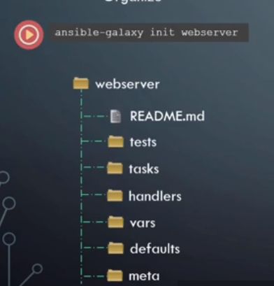

# Ansible Advance - Roles

[BACK TO README](README.md)

## Ansible Advanced Roles

Roles are the recommended way of developing a playbook in Ansible. They help us to organize our Ansible project in a standerd structure.  
We can share our work with ``Git`` (Gitlab, GitHub) or Ansible Galaxy. 

We you create a **role**, it automatically creates this folder structure for you that containes a set of folders, like tasks, handlers, vars, test, defaults, meta, etc. and a **README.md** file for document the role is created as well. This will help in creating the role as per best practice.

within the **roles** folder, the command for creating a role is:  

``ansible-galaxy init { role name }``




Roles expect files to be in certain directory names. Roles must include at least one of these directories, however it is perfectly fine to exclude any which are not being used. When in use, each directory must contain a ``main.yml`` file, which contains the relevant content:

* ``tasks`` - contains the main list of tasks to be executed by the role.  
* ``handlers`` - contains handlers, which may be used by this role or even anywhere outside this role.  
* ``defaults`` - default variables for the role (see Variables for more information).  
* ``vars`` - other variables for the role (see Variables for more information).
* ``files`` - contains files which can be deployed via this role.
* ``templates`` - contains templates which can be deployed via this role.
* ``meta`` - defines some meta data for this role. See below for more details.

> **NOTE:** to create a role it is not mandatory to use the ``ansble-galaxy init`` command. You can create manually the folder structure. 


Once a role is created it is easy to use it in any par of your playbook. Simply use the **roles** directive to assign the role to a server. When you do it, ansible automatically loads all the tasks from the task folder, all the variables from the variable folders and defaults from the defaults folder and makes them available to be used to the playbook.  

```yaml
# Sample playbook.yml
- name: Deploy App
  hosts: web
  roles:
    - webserver
```

As of Ansible 2.4, you can now use roles inline with any other tasks using ``import_role`` or ``include_role``:

```yaml
---

- hosts: webservers
  tasks:
  - debug:
      msg: "before we run our role"
  - import_role:
      name: example
  - include_role:
      name: example
  - debug:
      msg: "after we ran our role"
```

## DEMO

* **inventory.txt**

```txt
#Inventory
[db_and_web_servers]
db_and_web_server1 ansible_connection=ssh ansible_ssh_pass=Passw0rd ansible_host=192.168.1.14
db_and_web_server2 ansible_connection=ssh ansible_ssh_pass=Passw0rd ansible_host=192.168.1.15
```

* **app.py**

```python
# -------------------------------------------------
#
# This is the web application code. DO NOT MODIFY
#
# -------------------------------------------------

from flask import Flask
from flask.ext.mysql import MySQL
app = Flask(__name__)

mysql = MySQL()

# MySQL configurations
app.config['MYSQL_DATABASE_USER'] = 'db_user'
app.config['MYSQL_DATABASE_PASSWORD'] = 'Passw0rd'
app.config['MYSQL_DATABASE_DB'] = 'employee_db'
app.config['MYSQL_DATABASE_HOST'] = 'localhost'
mysql.init_app(app)

conn = mysql.connect()

cursor = conn.cursor()

@app.route("/")
def main():
    return "Welcome!"

@app.route('/how are you')
def hello():
    return 'I am good, how about you?'

@app.route('/read from database')
def read():
    cursor.execute("SELECT * FROM employees")
    row = cursor.fetchone()
    result = []
    while row is not None:
      result.append(row[0])
      row = cursor.fetchone()

    return ",".join(result)

if __name__ == "__main__":
    app.run()
```

* **playbook.yml**

```yaml
-
  name: Deploy a web application
  hosts: db_and_web_server1, db_and_web_server2 
  
  roles:
    - python
    - mysql_db
    _ flask_web
```

* **group_vars\db_and_web_servers.yml**

```yaml
db_name: employee_db
db_user: db_user
db_password: Passw0rd
```

* **roles\python\tasks\main.yml**

```yaml
---
    - name: Install dependencies
      apt: name={{ item }} state=present
      with_items:
       - python
       - python-setuptools
       - python-dev
       - build-essential
       - python-pip
       - python-mysqldb
    
    - include: tasks/deploy_db.yml
    - include: tasks/deploy_web.yml
```

* **roles\flask_web\tasks\main.yml**

```yaml
---
    - name: Install Python Flask dependencies
    pip:
        name: '{{ item }}'
        state: present
    with_items:
        - flask
        - flask-mysql

    - name: Copy web-server code
    copy: src=app.py dest=/opt/app.py

    - name: Start web-application
    shell: FLASK_APP=/opt/app.py nohup flask run --host=0.0.0.0 &
```

* **roles\mysql_db\tasks\deploy_db.yml**

```yaml
---
    - name: Install MySQL database
    apt:
        name: "{{ item }}"
        state:  present
    with_items:
        - mysql-server
        - mysql-client

    - name: Start Mysql Service
    service:
        name: mysql
        state: started
        enabled: yes

    - name: Create Application Database
    mysql_db: name={{ db_name }} state=present

    - name: Create Application DB User
    mysql_user:
        name: "{{ db_user }}"
        password: "{{ db_password }}"
        priv: '*.*:ALL'
        host: '%'
        state: present
```


## Referenes

[Ansible Roles Documenation](https://docs.ansible.com/ansible/2.6/user_guide/playbooks_reuse_roles.html)  
[ansible-galaxy](https://docs.ansible.com/ansible/latest/reference_appendices/galaxy.html)  
