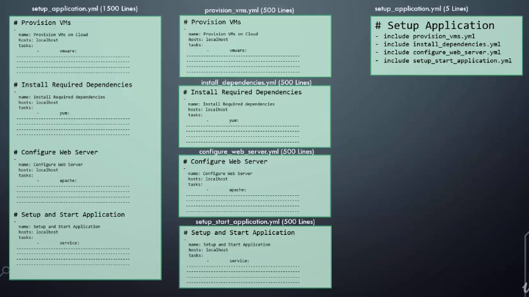
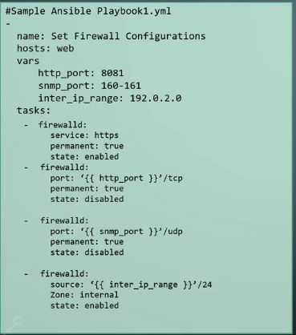
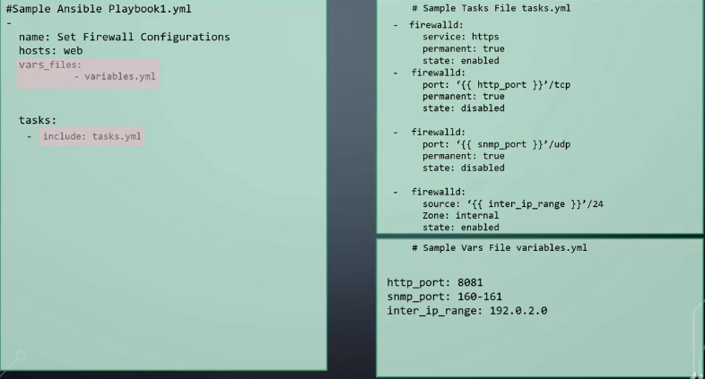
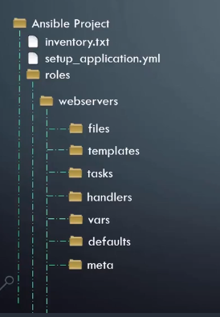
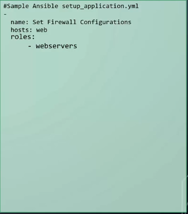

# Ansible basics - Roles

[BACK TO README](README.md)

## Ansible Roles

It is recomended to modularize an ansible project, to make our code more organized, reusable and easy to read. The implementation of this modularity is implemented in ansible with the help of includes and roles.

## INCLUDE



With this approach a big playbook is spplited in several playbook files and there is a master files which includes all of them.

The syntax for including playbooks is: `- include <playbook name>`

## INCLUDE TASKS AND VARIABLES

  


In order to include a variable file, instead of using `vars:` you must use:

```yaml
vars_file: -variables_file_1.yml
  -variables_file_2.yml
```

## ROLES

Use of Roles is recommended by ansible and it is the standard way to use it.  
Ansible roles define a structure for your project and define standards on how files and folders are organized within your project.

  


Within the **tasks** folder are stored the tasks files and within the **vars** folder are stored the vars files.

**Note:** When we use Roles we no longer needs to include the vars nor the tasks files.

In order to structure a project correctly we need a project folder, withinthis folder we will have the inventory and several one or several Playbooks.

We also have within the Ansible Project a folder call **roles** and within this folder we will have a folder for each role. Each role will have several defined folders to store its files (vars, tasks, handlers, etc).

In order to execute the project you need to run a playbook whihc includes different roles.
